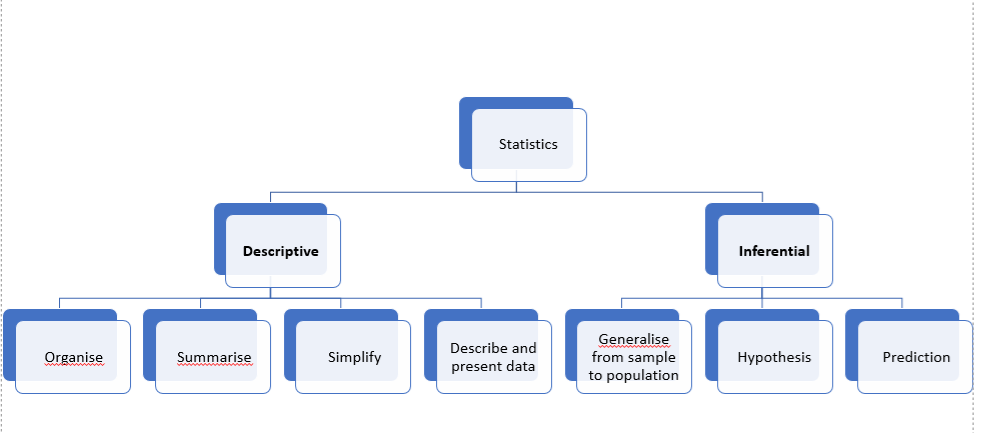

## Table of Content

1. [Statistics](#statistics) 
 - [Descriptive Statistics](descriptive)
 - [Inferential Statistics](inferential)
2. [Probability](#probability)
 - [Binomial Distribution](binomial)
 - [Conditional Probability](conditional)
 - [Bayes Rules](bayes)

==========================================

```
Statistrics and Propability are differnet but strongly related. 
Statustics: Analyse data from past events to infer what those models or causes could be..
Propability (Practical Statistics): Predication on events in future based on Models and causes we assume.
```
  
# <a name="statistics"/> Statistics: </br>

Statistics plays a main role in the field of research. It is concerned with developing and studying different methods for collecting, analyzing and presenting the empirical data.

The field of statistics is composed of two broad categories- Descriptive and inferential statistics. Both of them give us different insights about the data. One alone doesn’t not help us much to understand the complete picture of our data but using both of them together gives us a powerful tool for description and prediction.

## <a name="descriptive"/>Descriptive Statistics: 

Descriptive statistics is about **describing our collected data** using:
1. **Measures of center** (Mean, Median, Mode) 
2. **Measures of spread** (Range, Interquartile Range IQR, Standard Deviation, Variance),[ 5 Numbers Summary ](docs/5_Number_Summary.xlsx)
 - *Range*: difference between Max and Min
 - *Interquartile Range*: difference between Q3 & Q1. Q1: first Quartile 25%, Q3: third Quartile 75% 
 - *Variance*: Avarage squared difference of each observation from the mean.
 - *Standard Deviation*: is the square root of the variance.
3. **Shape of our distribution**
4. **Outliers**. 

We can also use plots of our data to gain a better understanding.


## <a name="inferential"/> Inferential Statistics

Inferential Statistics is about using our collected data to **draw conclusions to a larger population**. Performing inferential statistics well requires that we take a sample that accurately represents our population of interest.

A common way to collect data is via a survey. However, surveys may be extremely biased depending on the types of questions that are asked, and the way the questions are asked. 

It is necessary to identify the:
1. **Population** - our entire group of interest. (200,000 persons)
2. **Parameter** - numeric summary about a population (Proportion of all 200,000 persons who are vegetarian)
3. **Sample** - subset of the population (1000 person)
4. **Statistic**- numeric summary about a sample (40%)

Statistics and parameters are generally the mean or proportion for a group. Statistics being the value for the sample. Parameters being the value for the population. The population is our entire group of interest, while a sample is the selected subset of the population.

A **sampling distribution** is the distribution of a statistic. The way you select the sample, that will affect then  Statistic.


 

# <a name="probability"/> Probability: 

- The probability of an event ```P ```  must be between 0 and 1, inclusive

- The probability of the complement event  ```1- P ```  is 1 minus the probability of an event. That is the probability of all other possible events is 1 minus the probability an event itself. Therefore, the sum of all possible events is equal to 1.

- The probability of the composit event (Independent events),  ``` P*P*P*P ``` , is the product of those events.


# Resources
Udacity Data Analyst Nanodegree Program
