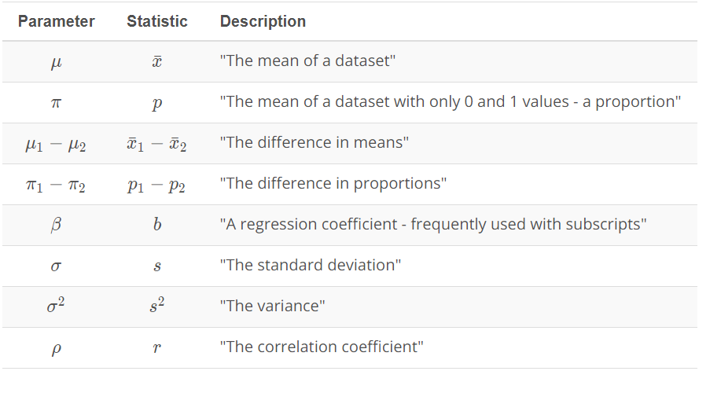
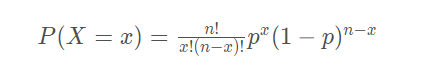

## Table of Content

1. [Statistics](#statistics) 
   - [Descriptive Statistics](descriptive)
   - [Inferential Statistics](inferential)
2. [Probability](#probability)
   - [Binomial Distribution](binomial)
   - [Conditional Probability](conditional)
   - [Bayes Rules](bayes)
3. [Notation](#notation)
4. Distribution
  - Binomial Distribution
  - Normal Distribution
  - Bootstrapping
  - Confidence Intervals


==========================================

```
Statistrics and Propability are differnet but strongly related. 
Statustics: Analyse data from past events to infer what those models or causes could be..
Propability (Practical Statistics): Predication on events in future based on Models and causes we assume.
```
  
# <a name="statistics"/> Statistics: </br>

Statistics plays a main role in the field of research. It is concerned with developing and studying different methods for collecting, analyzing and presenting the empirical data.

The field of statistics is composed of two broad categories- Descriptive and inferential statistics. Both of them give us different insights about the data. One alone doesn’t not help us much to understand the complete picture of our data but using both of them together gives us a powerful tool for description and prediction.

## <a name="descriptive"/>Descriptive Statistics: 

Descriptive statistics is about **describing our collected data** using:
1. **Measures of center** (Mean, Median, Mode) 
2. **Measures of spread** (Range, Interquartile Range IQR, Standard Deviation, Variance),[ 5 Numbers Summary ](docs/5_Number_Summary.xlsx)
 - *Range*: difference between Max and Min
 - *Interquartile Range*: difference between Q3 & Q1. Q1: first Quartile 25%, Q3: third Quartile 75% 
 - *Variance*: Avarage squared difference of each observation from the mean.
 - *Standard Deviation*: is the square root of the variance.
3. **Shape of our distribution**
4. **Outliers**. 

We can also use plots of our data to gain a better understanding.

## <a name="inferential"/> Inferential Statistics

Inferential Statistics is about using our collected data to **draw conclusions to a larger population**. Performing inferential statistics well requires that we take a sample that accurately represents our population of interest.

A common way to collect data is via a survey. However, surveys may be extremely biased depending on the types of questions that are asked, and the way the questions are asked. 

It is necessary to identify the:
1. **Population** - our entire group of interest. (200,000 persons)
2. **Parameter** - numeric summary about a population (Proportion of all 200,000 persons who are vegetarian)
3. **Sample** - subset of the population (1000 person)
4. **Statistic**- numeric summary about a sample (40%)

Statistics and parameters are generally the mean or proportion for a group. Statistics being the value for the sample. Parameters being the value for the population. The population is our entire group of interest, while a sample is the selected subset of the population.


 

# <a name="notation"/> Notation
Notation is a common math language used to communocate. Regardless which language you speak, you can work together using notation as a common language to solve problems.

## Notation for Parameters vs. Statistics
The common ways to notate parameters are differnet from the ways we notate statistics. In general, parameters are notated with Greek symbols, where statistics are either notated by lower case letters or the same Greek symbol with a hat on it.

**The most common parameters and corresponding statistics:**




# Distribution
A distribution shows the possible values a random variable can take and how frequently they occur. 

## Binomial Distribution:
A binomial distribution can be thought of as simply the probability of a **SUCCESS** or **FAILURE** outcome in an experiment or survey that is repeated multiple times. The binomial is a type of distribution that has two possible outcomes (the prefix “bi” means two, or twice). For example, a coin toss has only two possible outcomes: heads or tails and taking a test could have two possible outcomes: pass or fail.

The first variable in the binomial formula, n, stands for the number of times the experiment runs. The second variable, p, represents the probability of one specific outcome. For example, let’s suppose you wanted to know the probability of getting a 1 on a die roll. if you were to roll a die 20 times, the probability of rolling a one on any throw is 1/6. Roll twenty times and you have a binomial distribution of (n=20, p=1/6). SUCCESS would be “roll a one” and FAILURE would be “roll anything else.” If the outcome in question was the probability of the die landing on an even number, the binomial distribution would then become (n=20, p=1/2). That’s because your probability of throwing an even number is one half.

**The Binomial Distribution Formula** 




where n is the number of events, x is the number of "successes", and p is the probability of "success".

We can now use this distribution to determine the probability of things like:

- The probability of 3 heads occurring in 10 flips.
- The probability of observing 8 or more heads occurring in 10 flips.
- The probability of not observing any heads in 20 flips.


## Normal Distribution

## Sampling Distributions
A sampling distribution is the distribution of a statistic. The way you select the sample, that will affect then  Statistic.  [Practice sample distribution with Python](practice/Sampling_Distributions.ipynb)

**Note from Practical Sample distribution:** We found that for proportions (and also means, as proportions are just the mean of 1 and 0 values), the following characteristics hold.

The sampling distribution is centered on the original parameter value.

The sampling distribution decreases its variance depending on the sample size used. Specifically, the variance of the sampling distribution is equal to the variance of the original data divided by the sample size used. This is always true for the variance of a sample mean!

In notation, we say if we have a random variable, **X**, with variance of σ<sup>2</sup>, then the distribution of **X** (the sampling distribution of the sample mean) has a variance of 

Parameter is a numeric summary of a population which is a fixed value. However, statistics will change based on a sample you select from the population. So what are the common traits of sampling distributions??

Two important mathematical theorems for working with sampling distributions include:

**1- Law of Large Numbers**
The Law of Large Numbers says that as our sample size increases, the sample mean gets closer to the population mean, but how did we determine that the sample mean would estimate a population mean in the first place? How would we identify another relationship between parameter and statistic like this in the future?

Three of the most common ways are with the following estimation techniques:

* [Maximum Likelihood Estimation](https://en.wikipedia.org/wiki/Maximum_likelihood_estimation)
* [Method of Moments Estimation](https://en.wikipedia.org/wiki/Method_of_moments_(statistics))
* [Bayesian Estimation](https://en.wikipedia.org/wiki/Bayes_estimator)

**2- Central Limit Theorem**

The Central Limit Theorem states that with a large enough sample size the sampling distribution of the mean will be normally distributed. 
- [Practice Central Limit Theorem 1](practice/Central_Limit_Theorem.ipynb)  
- [Practice Central Limit Theorem (Means)](practice/Central_Limit_Theorem2.ipynb) 
- [Practice Central Limit Theorem (Variance)](practice/Central_Limit_Theorem3.ipynb)

The Central Limit Theorem actually applies for these well known statistics:

1. Sample means 
2. Sample proportions
3. Difference in sample means 
3. Difference in sample proportions 

**Notes** 
- Sample variances are actually known to follow a different type of mathematical distribution known as a chi-squared distribution. Which is a more right-skewed distribution than a normal.
- In all scenarios we relied on mathmatical theorems, like the central limit theorem leads to gaps in whether we  have acheiced a large sample size or which statistics the theorem applied to. So instead on relying on theorems we could simulate the sampling distribution. This can be acheived by a techniqe called **Bootstrapping**.

## Bootstrapping 
- [Practice Bootstrapping with Python](practice/Bootstrapping.ipynb)

- Bootstrapping in statistics means sampling with replacement. Using random.choice in python actually samples in this way. Where the probability of any number in our set stays the same regardless of how many times it has been chosen.
- We can use bootstrapping to simulate the creation of sampling distribution.
- By bootstrapping and then calculating repeated values of our statistics, we can gain an understanding of the sampling distribution of our statistics.
- We can use bootstrapping and sampling distributions to build confidence intervals for our parameters of interest.

##  Confidence Intervals
Confidence intervals give us a range of plausible values for some unknown value based on results from a sample. Most commonly, the 95% confidence level is used. However, other confidence levels can be used, for example, 90% and 99%.

- [Practice Confidence Intervals 1 with Python](practice/Confidence_Intervals1.ipynb)
- [Practice Confidence Intervals 2 with Python](practice/Confidence_Intervals2.ipynb)

In the above 2 examples, I compared the average heights of coffee drinkers to non-coffee drinkers, there are a number of other applications that use a comparison for the means of two groups.

**A/B testing** is one of the most important to businesses around the world. In this technique, you are changing something about your web layout to understand how it impacts users. You ideally want to provide a page that leads to more clicks, higher revenue, and/or higher customer satisfaction.

Confidence intervals take an aggregate approach towards the conclusions made based on data, as these tests are aimed at understanding population parameters (which are aggregate population values).

Alternatively, machine learning techniques take an individual approach towards making conclusions, as they attempt to predict an outcome for each specific data point.The most two fundamental machine learning approaches used in practice: **linear and logistic regression**.

**Practical and statistical significance.**
Using confidence intervals and hypothesis testing, you are able to provide statistical significance in making decisions.
However, it is also important to take into consideration practical significance in making decisions. Practical significance takes into consideration other factors of your situation that might not be considered directly in the results of your hypothesis test or confidence interval. Constraints like space, time, or money are important in business decisions. However, they might not be accounted for directly in a statistical test.

## Hypothesis Testing / IMPORTATNT/ 
Hypothesis Testing and Confidence Interval allow us to use only **sample data** to draw conclusions about an **entire population**.
Hypothesis Testinng is all about helping business make better and more inforem database decisions

**How we can set up and evaluate the result of hypothesis testing???**

When we performing a Hypothesis Testing, the first thing we need to do is to translate our question into two comparing hypotheses. 
1. Null **H<sub>0</sub>**
2. Alternative **H<sub>1</sub>**

 The general rules for setting up null and alternative hypotheses:
 - The **H<sub>0</sub>** is true before you collect any data.
 - The **H<sub>0</sub>** usually states there is no effect or that two groups are equal.
 - The **H<sub>0</sub>** and **H<sub>1</sub>** are competing, non-overlapping hypotheses.
 - **H<sub>1</sub>** is what we would like to prove to be true.
 - **H<sub>0</sub>**  contains an equal sign of some kind - either =, ≤, or ≥.
 - **H<sub>1</sub>** contains the opposition of the null - either ≠, >, or <. 

```
An exapmle about hypotheses
We can relate this to the idea that "innocent" is before we collect any data. Then the alternative must be a competing, non-overlapping hypothesis. Hence, the alternative hypothesis is that an individual is guilty.
```

Another exapmle about hypotheses<br/>
Because we wanted to test if a new page was better than an existing page, we set that up in the alternative. Two indicators are that the null should hold the equality, and the statement we would like to be true should be in the alternative. Therefore, it would look like this:<br/><br/>

**H<sub>0</sub>:** μ<sub>new</sub> ≤ μ<sub>old</sub> **or** μ<sub>1</sub> ≤ μ<sub>2</sub><br/>
**H<sub>1</sub>:** μ<sub>new</sub> > μ<sub>old</sub> **or**  μ<sub>1</sub> > μ<sub>2</sub><br/>

 μ<sub>1</sub> represents the population mean return from the new page. Similarly,  μ<sub>2</sub> represents the population mean return from the old page.

Depending on your question of interest, you would change your null and alternative hypotheses to match.


# <a name="probability"/> Probability: 
Probabiltiy is the chance an **event** to occur. Like flipping a coin. We have 2 probabilities involved; either getting a Head or a Tail. That means we have 2 possible events and we need to assign possiblility for each event.

- The probability of an event ```P ```  must be between 0 and 1, inclusive. ```1```  means absolute certainity of the event occuring while ```0```  means absolute certainity of the event not occuring

- The probability of the complement event  ```1- P ```  is 1 minus the probability of an event. That is the probability of all other possible events is 1 minus the probability an event itself. Therefore, the sum of all possible events is equal to 1.

- The probability of the composit event (Independent events),  ``` P*P*P*P ``` , is the product of those events.


# Resources
1. Udacity Data Analyst Nanodegree Program
2. https://www.statisticshowto.datasciencecentral.com/probability-and-statistics/binomial-theorem/binomial-distribution-formula/
3. https://en.wikipedia.org/
4. www.khanacademy.org/


